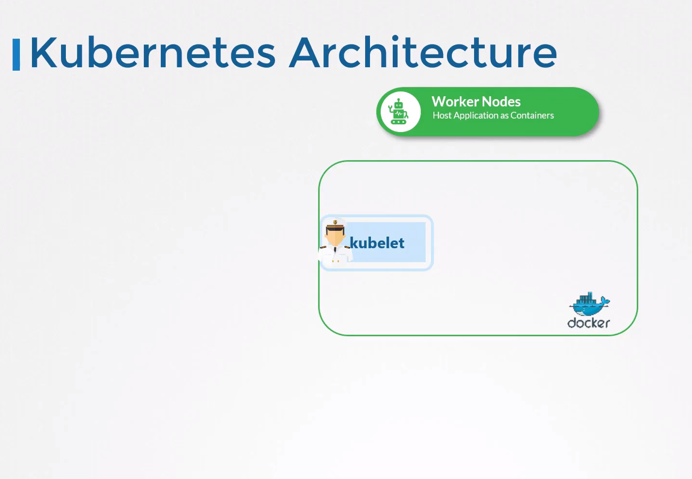
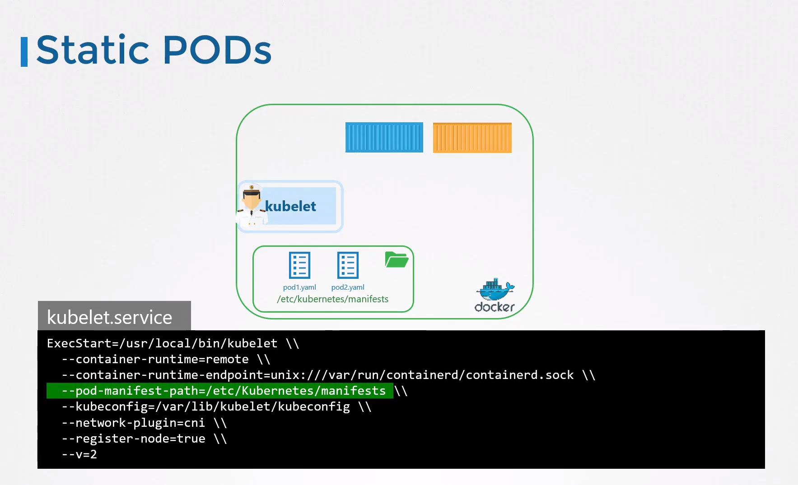
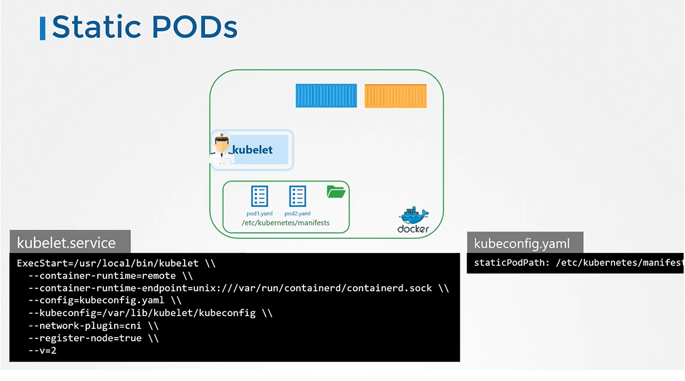
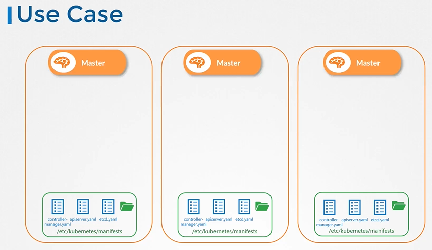
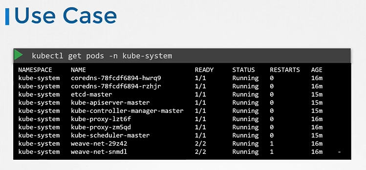
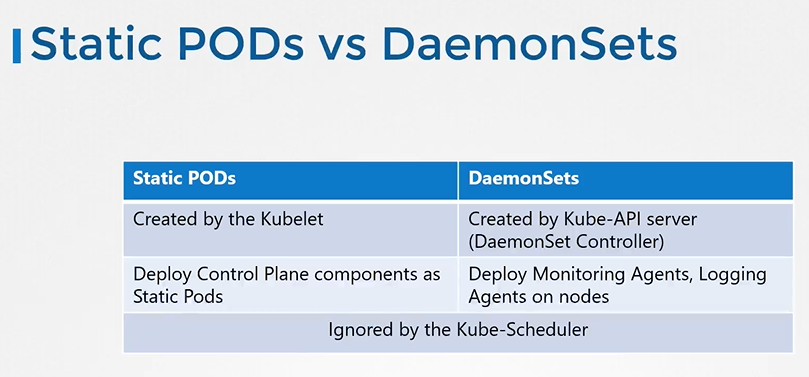

# Introduction

- Earlier in this course, we talked about the architecture and how the kubelet functions as one of the many control plane components in Kubernetes. The kubelet relies on the kube-apiserver for instructions on what Pods to load on its Node, which was based on a decision made by the kube-scheduler, which was stored in the ETCD data store.
- What if there was no kube-apiserver?
- No kube-scheduler and no controllers and no ETCD cluster?
- What if there was no master at all? What if there were no other Nodes?
  
  
- Is there anything that the kubelet can do as the captain on the ship?
- Can it operate as an independent Node? If so, who would provide the instructions required to create those Pods?
- Well, the kubelet can manage a Node independently.
- On the ship host, we have the kubelet installed, and of course we have docker as well to run containers. There is no Kubernetes cluster, so there are no kube-apiserver or anything like that.
- The one thing that the kubelet knows to do is create Pods, but we don't have an API server here to provide Pod details.
- By now, we know that to create a Pod, you need the details of the Pod in a Pod definition file. But how do you provide the Pod definition file to the kubelet without a kube-apiserver?
- `You can configure the kubelet to read the Pod definition files from a directory on the server designated to store information about Pods. Place the Pod definition files in this directory. The kubelet periodically checks this directory for files, reads these files, and creates Pods on the host.`
- Location to define Pod definition files for Static Pods:`/etc/Kubernetes/manifests`
  

# Static Pods

- Static pods in Kubernetes are the pods that are directly managed by the kubelet daemon on a specific node, rather than being managed by the Kubernetes control plane.
- These pods are typically defined via static pod manifests located on the node's file system (default path - /etc/kubernetes/manifests) monitored by the kubelet.
- Static Pods have node name appended at the end.
  For ex - webapp-vfgd-`node01`


## Configure Static Pod

- The designated directory can be any directory on the host and the location of that directory is passed in to the kubelet as an option while running the service.
- The option is named as **`--pod-manifest-path`**.
  
  

## Another way to configure static pod

- Instead of specifying the option directly in the **`kubelet.service`** file, you could provide a path to another config file using the config option, and define the directory path as staticPodPath in the file.
  
  

## View the static pods

- To view the static pods
  
  ```
  $ docker ps
  ```
  
  

#### The kubelet can create both kinds of pods - the static pods and the ones from the api server at the same time.


## Static Pods - Use Case

Since static Pods are not dependent on the Kubernetes control plane, you can use static Pods `to deploy the control plane components itself as Pods on a Node.`

Well, start by installing **`kubelet`** on all the master Nodes, then create Pod definition files that uses docker images of the various control plane components such as the API server, controller, ETCD, et cetera.
Place the definition files in the designated manifest folder, and the kubelet takes care of deploying the control plane components themselves as Pods on the cluster.

This way, you don't have to download the binaries, configure services, or worry about the services crashing. If any of these services were to crash, since it's a static Pod, it'll automatically be restarted by the kubelet. That's how the kube admin tool sets up a Kubernetes cluster.





## Static Pods vs DaemonSets



#### K8s Reference Docs

- https://kubernetes.io/docs/tasks/configure-pod-container/static-pod/

