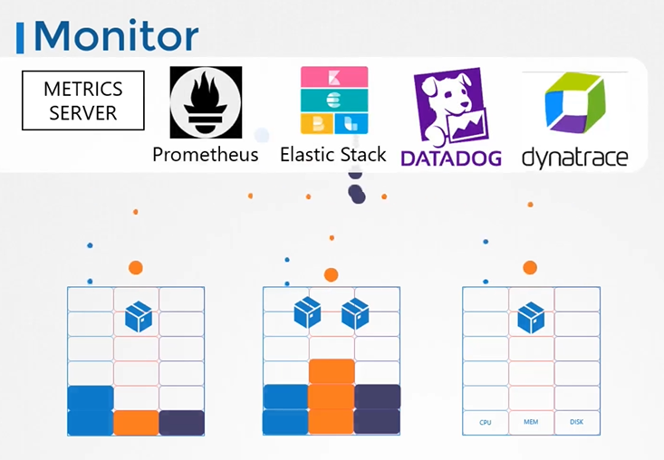

# Monitor Cluster Components

- Take me to [Video Tutuorials](https://kodekloud.com/topic/monitor-cluster-components/)

In this section, we will take a look at monitoring kubernetes cluster

#### How do you monitor resource consumption in kubernetes? or more importantly, what would you like to monitor?



## Heapster vs Metrics Server

- Heapster is now deprecated and a slimmed down version was formed known as the **`metrics server`**.
- **`Metrics server`** is a component in Kubernetes that collects resource metrics from Kubelets in a cluster. It is primarily used to provide resource utilization data such as CPU and memory usage for nodes and pods in a Kubernetes cluster. This data is crucial for monitoring and autoscaling purposes.
- Why Metrics Server is used:

1. **Resource Monitoring**: Metrics Server collects resource usage metrics from every node in the cluster, providing insights into how resources such as CPU and memory are being utilized by pods and nodes.
2. **Autoscaling**: Kubernetes Horizontal Pod Autoscaler (HPA) relies on Metrics Server to automatically scale the number of pods in a deployment or replica set based on resource utilization metrics. For example, if CPU usage exceeds a certain threshold, HPA can dynamically increase the number of pod replicas to handle the load.

  

---

The **`kubectl top nodes`** and **`kubectl top pods`** commands do rely on having Metrics Server installed in the Kubernetes cluster. Without Metrics Server, these commands will not work as intended. They rely on Metrics Server to collect resource usage data from nodes and pods and provide it in a format that can be queried using `kubectl`.
If the Metrics Server is not installed, attempting to use these commands will likely result in an error indicating that the metrics are not available. Therefore, it's essential to have Metrics Server deployed in your Kubernetes cluster if you intend to use these commands for monitoring resource usage.

---


## Metrics Server


#### How are the metrics generated for the PODs on these nodes?


## Metrics Server - Getting Started


- Clone the metric server from github repo
  
  ```
  $ git clone https://github.com/kubernetes-incubator/metrics-server.git
  ```
- Deploy the metric server
  
  ```
  $ kubectl create -f metric-server/deploy/1.8+/
  ```
- View the cluster performance
  
  ```
  $ kubectl top node
  ```
- View performance metrics of pod
  
  ```
  $ kubectl top pod
  ```
  
  ---
  
  The **`kubectl top nodes`** and **`kubectl top pods`** commands do rely on having Metrics Server installed in the Kubernetes cluster. Without Metrics Server, these commands will not work as intended. They rely on Metrics Server to collect resource usage data from nodes and pods and provide it in a format that can be queried using `kubectl`.
  If the Metrics Server is not installed, attempting to use these commands will likely result in an error indicating that the metrics are not available. Therefore, it's essential to have Metrics Server deployed in your Kubernetes cluster if you intend to use these commands for monitoring resource usage.

---


