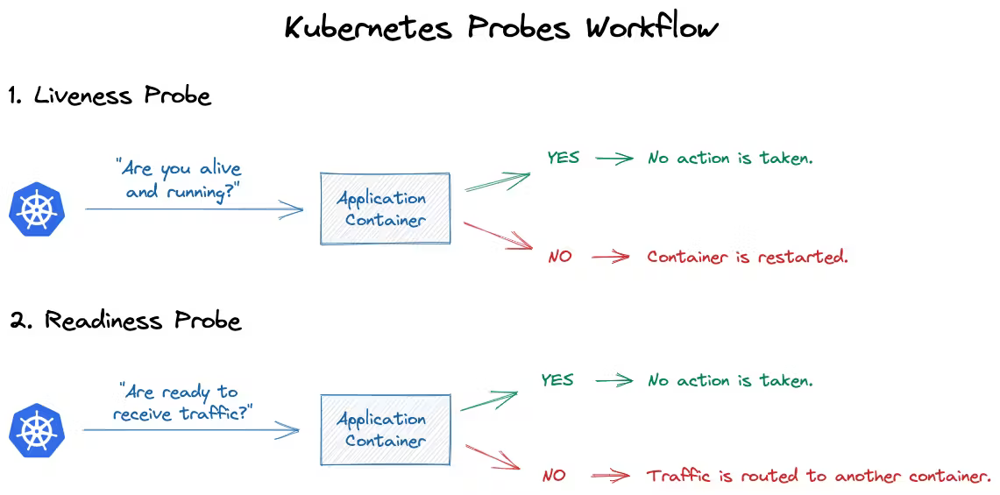

# Liveness & Readiness Probes:

- **Liveness Probe:** Imagine you have an app running on a server. The liveness probe is like a health check for your app. It asks, "Hey, are you still alive and functioning?" It regularly checks if your app is functioning properly. If the app doesn't respond or is stuck, the liveness probe detects this and can take action, like restarting the app, to keep things running smoothly. It ensures that your app is up and running as expected.
- **Readiness Probe:** Now, let's say your app needs some time to get ready after it starts up. Maybe it's loading some data or connecting to a database. The readiness probe is like asking, "Hey, are you ready to start handling requests?" It checks if your app is fully prepared to start doing its job. If the app isn't ready yet, the readiness probe holds off sending traffic to it until it is, preventing any premature requests that might cause errors. It ensures that your app is ready to handle incoming requests without any issues.
  
  
  `In a nutshell, the liveness probe checks if your app is alive and functioning, while the readiness probe checks if your app is ready to handle requests. Both probes help ensure the stability and reliability of your application.`

# How Kubernetes does Health checks:

In Kubernetes, liveness and readiness probes are configured within the pod's YAML definition, specifically in the pod's container specification. Let's break down how Kubernetes does it:

**1. Liveness Probe:**

- Kubernetes periodically sends a request to the specified endpoint (HTTP GET, TCP socket, or executing a command inside the container) based on the liveness probe configuration.
- If the probe fails to receive a successful response within a specified timeframe or if the command exits with a non-zero status code, Kubernetes considers the container unhealthy.
- When a container is detected as unhealthy by the liveness probe, Kubernetes takes action according to the specified policy, such as restarting the container.

**2. Readiness Probe:**

- Similarly, Kubernetes periodically sends requests to the specified endpoint to check if the container is ready to serve traffic.
- If the readiness probe fails to receive a successful response within a specified timeframe or if the command exits with a non-zero status code, Kubernetes considers the container not ready.
- When a container is not ready, Kubernetes removes it from the list of endpoints that receive traffic. This prevents traffic from being directed to the container until it becomes ready again.

These probes are configured using the `livenessProbe` and `readinessProbe` fields in the container specification of the pod's YAML file. You can specify various parameters such as the type of probe (HTTP, TCP, or Exec), the endpoint to check, timeouts, and thresholds for success or failure.

- Example YAML configurations:
- Here's a simple YAML configuration for a Pod that includes both liveness and readiness probes:
  
  ```yaml
  apiVersion: v1
  kind: Pod
  metadata:
    name: my-app
  spec:
    containers:
    - name: my-app-container
      image: my-app-image:latest
      ports:
      - containerPort: 8080
      livenessProbe:
        httpGet:
          path: /healthz
          port: 8080
        initialDelaySeconds: 15
        periodSeconds: 10
      readinessProbe:
        httpGet:
          path: /ready
          port: 8080
        initialDelaySeconds: 20
        periodSeconds: 5
  ```

#### Let's break this down:

- `livenessProbe`: This section defines how Kubernetes checks if the container is alive. In this example, it performs an HTTP GET request to the `/healthz` path on port 8080 of the container. If the container responds with a success code (like 200), Kubernetes considers the container alive. It waits for 15 seconds after the container starts (`initialDelaySeconds`) and then checks every 10 seconds (`periodSeconds`) thereafter.
- `readinessProbe`: This section defines how Kubernetes checks if the container is ready to serve requests. Similar to the liveness probe, it performs an HTTP GET request, but this time to the `/ready` path. Again, if the container responds successfully, Kubernetes considers it ready to serve traffic. It waits for 20 seconds after the container starts before performing the first check (`initialDelaySeconds`) and then checks every 5 seconds thereafter (`periodSeconds`).

