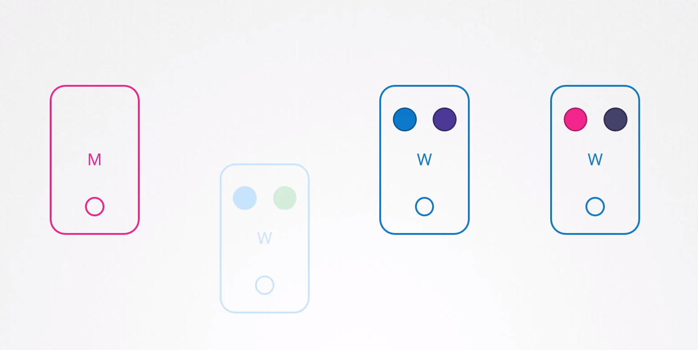

# OS Upgrades

- The lecture begins by highlighting scenarios where you might need to take down nodes in your cluster for maintenance purposes, such as upgrading base software or applying patches like security updates.

1. **Impact of Node Downtime on Pods**:
   
   - When a node goes down, the pods running on that node become inaccessible. Depending on how the pods were deployed, user access to applications may be impacted.
   - For example, if there are multiple replicas of a pod, users accessing the application served by those replicas might not be affected, whereas if there's only one instance of a pod, users accessing that application would be impacted.
     
     
2. **Handling Node Downtime in Kubernetes**:
   
   * If a node comes back online immediately, the kubelet process starts, and the pods on that node come back online as well.
   * If the node was down for more than 5 minutes, Kubernetes considers the pods on that node as dead, and they are terminated. This time limit is known as the "pod-eviction-timeout" and has a default value of five minutes, set on the controller manager.
     
     
3. **Recovery Process for Pods**:
   
   * If the pods were part of a replica set, they are recreated on other nodes after being terminated.
   * If a node comes back online after the pod-eviction-timeout, it comes up empty without any pods scheduled on it.
     
     
4. **Maintenance Strategies**:
   
   * If you have maintenance tasks to perform on a node, and you are certain it will be back online within 5 minutes, and the workloads have replicas and can afford downtime, you can quickly upgrade and reboot the node.
   * `A safer approach is to drain the node of all workloads, which gracefully terminates the pods and recreates them on other nodes in the cluster. The node is also cordoned or marked as unschedulable to prevent new pods from being scheduled on it until the maintenance is complete.`
5. **Drain and Uncordon Commands**:
   
   * `drain`: This command gracefully terminates the pods on the node and moves them to other nodes in the cluster. It also marks the node as unschedulable.
     
     ```
     kubectl drain node01
     ```
   * `uncordon`: This command removes the unschedulable mark from a node, allowing pods to be scheduled on it again. When the node is back online after maintenance, it is still unschedulable. You then need to uncordon it.
     
     ```
     kubectl uncordon node01
     ```
   * `cordon`: This command marks a node as unschedulable, but unlike `drain`, it does not terminate or move existing pods.
     
     ```
     kubectl cordon node01
     ```
6. **Impact on Pod Placement**:
   
   - It's important to note that pods moved to other nodes during maintenance don't automatically return to the original node when it comes back online. They will stay on the new node unless explicitly deleted or recreated.

# Kubernetes Kubeadm Cluster Upgrade Steps:

This document outlines the steps to upgrade a Kubernetes cluster using `kubeadm`. The example version used for the upgrade is `v1.19.0`. Adjust the version numbers according to your requirements.


## Upgrade Control Plane Node

### Step 1: Check Current Nodes Status

```sh
kubectl get nodes
```

### Step 2: Drain the Control Plane Node

```sh
kubectl drain controlplane --ignore-daemonsets
```

### Step 3: Update Package Lists

```sh
apt update
```

### Step 4: Install the Desired Version of `kubeadm`

Replace `<version you want to upgrade to>` with the desired version number (e.g., `1.19.0`).

```sh
apt install kubeadm=<version you want to upgrade to>.0-00
```

### Step 5: Apply the Upgrade Using `kubeadm`

Replace `v1.19.0` with the desired version number.

```sh
kubeadm upgrade apply v1.19.0
```

### Step 6: Install the Desired Version of `kubelet`

```sh
apt install kubelet=1.19.0-00
```

### Step 7: Restart `kubelet`

```sh
systemctl restart kubelet
```

### Step 8: Verify Node Status

```sh
kubectl get nodes
```

### Step 9: Uncordon the Control Plane Node

```sh
kubectl uncordon controlplane
```

## Upgrade Worker Node

### Step 1: Drain the Worker Node

```sh
kubectl drain node01 --ignore-daemonsets
```

### Step 2: SSH into the Worker Node

```sh
ssh node01
```

### Step 3: Update Package Lists on Worker Node

```sh
apt update
```

### Step 4: Upgrade the Node Using `kubeadm`

```sh
kubeadm upgrade node
```

### Step 5: Install the Desired Version of `kubelet` on Worker Node

```sh
apt install kubelet=1.19.0-00
```

### Step 6: Restart `kubelet` on Worker Node

```sh
systemctl restart kubelet
```

### Step 7: Verify Node Status

Return to the control plane node and check the status of the nodes:

```sh
kubectl get nodes
```

### Step 8: Uncordon the Worker Node

```sh
kubectl uncordon node01
```


