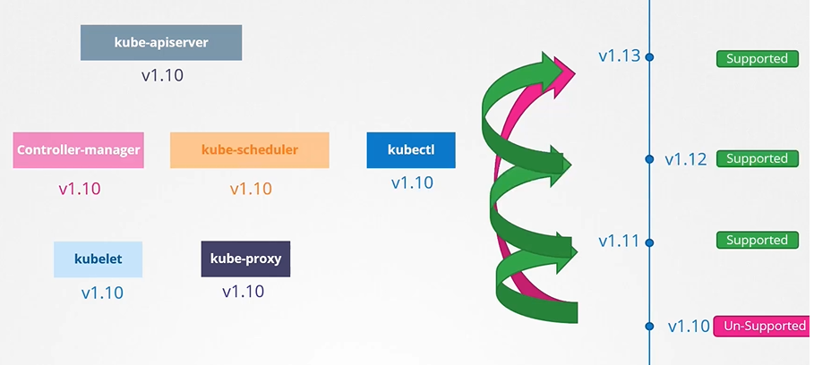
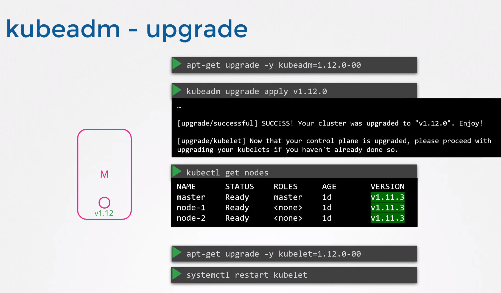

# Cluster Upgrade Introduction

1. **Introduction to Cluster Upgrade Process:**
   
   * Kubernetes manages software releases, including core control plane components like kube-apiserver, kube-controller-manager, kube-scheduler, kubelet, and kube-proxy.
   * Components can be at different release versions, but none should be at a version higher than the kube-apiserver.
2. **When to Upgrade:**
   
   * Kubernetes supports up to the recent three minor versions.
   * Before the release of a new version, it's a good time to upgrade.
   * Do we upgrade directly from 1.10 to 1.13? No. The recommended approach is to upgrade one minor version at a time.
     
     
3. **Upgrade Process:**

* Depends on cluster setup:
  * Managed Kubernetes cluster in AWS, GCP can be upgraded in a few clicks,
  * If you deployed the cluster using kubeadm deployment then the tool can help you plan and upgrade the cluster.
  * If you deployed your cluster from scratch, then you manually upgrade the different components of the cluster yourself.
    
    
* Upgrade involves two major steps: upgrading master nodes and then worker nodes.
* Control plane components briefly go down during master upgrade, but worker nodes and applications continue to function normally.
* Management functions like kubectl access are unavailable during master upgrade.

4. **Strategies for Worker Node Upgrade:**
   
   * Upgrade all nodes at once (results in downtime).
   * Upgrade one node at a time to minimize downtime.
   * Add new nodes with newer software version and decommission old ones (especially convenient in cloud environments).
5. **Master Upgrade with Kubeadm:**
   
   * Use kubeadm upgrade plan command to get information about the current cluster version, kubeadm tool version, latest stable version of Kubernetes, control plane components, and their upgrade versions.
   * Upgrade kubeadm tool itself before upgrading the cluster.
   * Upgrade one minor version at a time using kubeadm upgrade apply command.
   * After upgrading control plane components, manually upgrade kubelet version on your master if you have.
     
     
6. **Worker Node Upgrade Process:**
   
   * Use kubectl drain command to safely terminate pods from a node and reschedule them on other nodes.
   * Upgrade kubeadm and kubelet packages on the worker nodes.
   * Use kubeadm tool upgrade command to update node configuration for the new kubelet version.
   * Restart kubelet service on each node.
   * Use kubectl uncordon command to mark the node as schedulable again.
   * Pods may not immediately return to the upgraded node; they come back when deleted from other nodes or new pods are scheduled.
     
     
     

