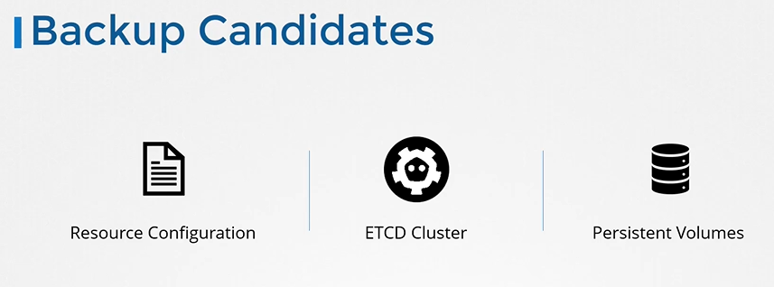
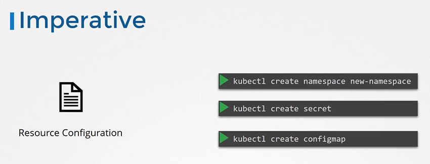
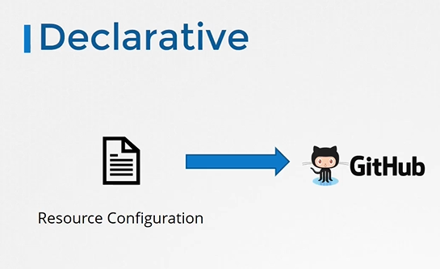
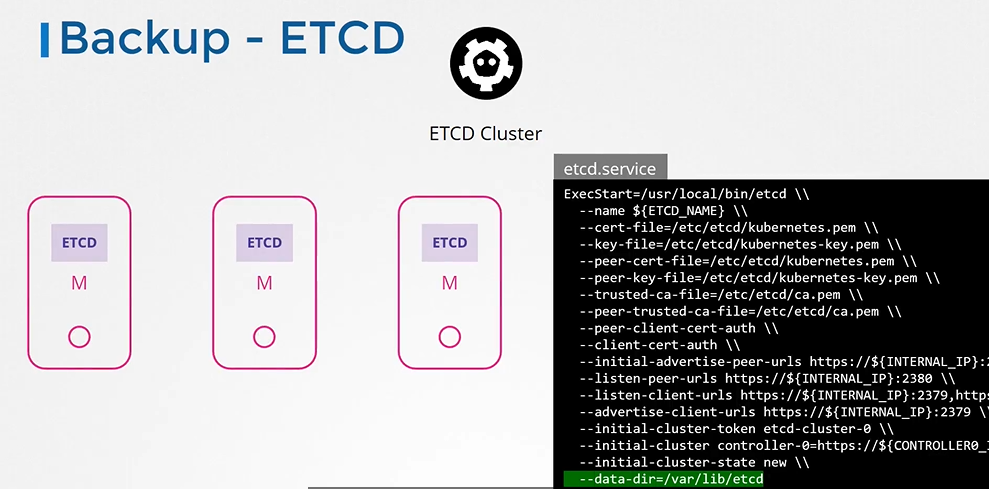
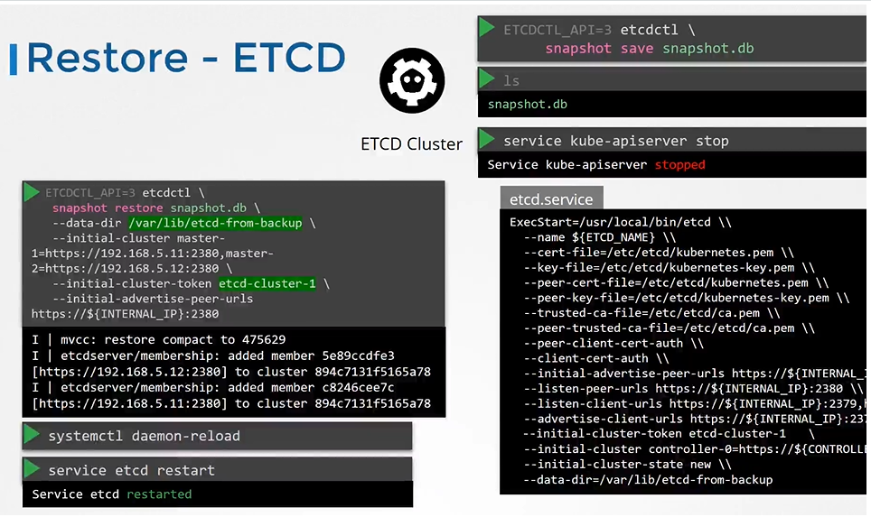
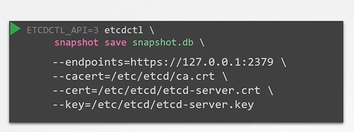

# Backup and Restore Methods

- Take me to [Video Tutorial](https://kodekloud.com/topic/backup-and-restore-methods/)

In this section, we will take a look at backup and restore methods

## Backup Candidates

**What to Back Up:**

* **ETCD Cluster state:** This includes information about nodes, deployments, pods, services, and all other resources created within the cluster. This information is stored in the etcd cluster, a highly available key-value store.
* **Application configurations:** These are the definition files (YAML or JSON) used to create deployments, pods, and services. They represent the desired state of your applications.
* **Persistent storage:** If your applications use persistent volumes to store data, you'll need to back up that data as well.

  

## Resource Configuration

- Imperative way
  
  
- Declarative Way (Preferred approach)
  
  ```
  apiVersion: v1
  kind: Pod
  metadata:
    name: myapp-pod
    labels:
      app: myapp
      type: front-end
  spec:
    containers:
    - name: nginx-container
      image: nginx
  ```

  

- A good practice is to store resource configurations on source code repositories like github.
  
  

## Backup - Resource Configs

- One of the commands that can be used in a backup script is to get all pods, and deployments, and services in all namespaces using the kubectl utility's get all command, and extract the output in a YAML format, then save that file.

  ```
  $ kubectl get all --all-namespaces -o yaml > all-deploy-services.yaml (only for few resource groups)
  ```

- And that's just for a few resource group. There are many other resource groups that must be considered. Of course, you don't have to develop that solution yourself.

- There are tools like **`ARK`** or now called **`Velero`** by Heptio that can do this for you.
  
  

## Backup - ETCD

- So, instead of backing up resources as before, you may choose to backup the ETCD cluster itself.
  
  
- You can take a snapshot of the etcd database by using **`etcdctl`** utility snapshot save command.
  
  ```
  $ ETCDCTL_API=3 etcdctl snapshot save snapshot.db
  ```
  
  ```
  $  ETCDCTL_API=3 etcdctl snapshot status snapshot.db
  ```
  
  

## Restore - ETCD

- To restore etcd from the backup at later in time. First stop kube-apiserver service
  
  ```
  $ service kube-apiserver stop
  ```
- Run the etcdctl snapshot restore command
- Update the etcd service
- Reload system configs
  
  ```
  $ systemctl daemon-reload
  ```
- Restart etcd
  
  ```
  $ service etcd restart
  ```
  
  
- Start the kube-apiserver
  
  ```
  $ service kube-apiserver start
  ```

#### With all etcdctl commands specify the cert,key,cacert and endpoint for authentication.

```
$ ETCDCTL_API=3 etcdctl \
  snapshot save /tmp/snapshot.db \
  --endpoints=https://[127.0.0.1]:2379 \
  --cacert=/etc/kubernetes/pki/etcd/ca.crt \
  --cert=/etc/kubernetes/pki/etcd/etcd-server.crt \
  --key=/etc/kubernetes/pki/etcd/etcd-server.key
```



#### K8s Reference Docs

- https://kubernetes.io/docs/tasks/administer-cluster/configure-upgrade-etcd/

