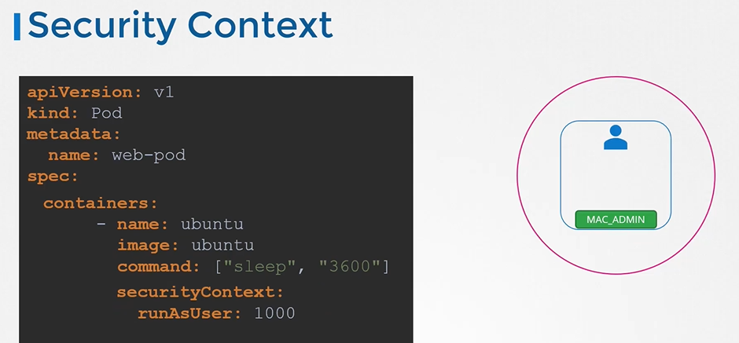

## Docker Security

* **User Permissions:** By default, containers run as the `root` user. This can be insecure. We can specify a non-root user to run the container process or set the user in the Docker image itself.
* **Capabilities:** Even with a non-root user, capabilities can be granted to provide specific privileges. By default, Docker limits these capabilities but we can further restrict or grant additional capabilities using the `cap-add` and `cap-drop` options in the `docker run` command.
  
  ```
  $ docker run --user=1001 ubuntu sleep 3600
  $ docker run -cap-add MAC_ADMIN ubuntu
  ```
  
  

## Security Context in Kubernetes

- In Kubernetes, the `securityContext` field is used to specify security settings for a Pod or Container. Within the `securityContext`, you can define which Linux capabilities are added or dropped from the default set.

- In the context of Kubernetes (k8s) security, `SYS_TIME` and `MAC_ADMIN` refer to specific Linux capabilities.
- Capabilities in Linux are a fine-grained way of assigning specific privileges to processes, as opposed to the traditional all-or-nothing superuser (root) privileges.
- Kubernetes leverages these Linux capabilities to manage the permissions of containers running in a cluster.

For example:

1. **SYS_TIME**:
   
   - **Description**: The `SYS_TIME` capability allows a process to change the system clock.
   - **Implications**: If a container has the `SYS_TIME` capability, it can alter the system time, which can affect time-based security mechanisms (like token expiration) and can disrupt time synchronization across the cluster. Typically, this capability is not required for most applications and should be granted only if absolutely necessary.
2. **MAC_ADMIN**:
   
   - **Description**: The `MAC_ADMIN` capability allows a process to administer Mandatory Access Control (MAC) settings. This includes modifying security policies in systems like SELinux (Security-Enhanced Linux).
   - **Implications**: Granting `MAC_ADMIN` to a container can have significant security implications, as it could potentially allow the container to change security policies, affecting the overall security posture of the system. This capability should be used with caution and only when there is a clear and justified need.


Here's an example of how you might specify capabilities in a Kubernetes Pod spec:

```yaml
apiVersion: v1
kind: Pod
metadata:
  name: example-pod
spec:
  containers:
  - name: example-container
    image: example-image
    securityContext:
      capabilities:
        add: ["SYS_TIME", "MAC_ADMIN"]
        drop: ["NET_RAW", "MKNOD"]
```

In this example, the `example-container` is given the `SYS_TIME` and `MAC_ADMIN` capabilities, while `NET_RAW` and `MKNOD` are dropped.

### Best Practices

- **Minimize Capabilities**: Only add the capabilities that are strictly necessary for your container to function. Dropping all unnecessary capabilities reduces the attack surface.
- **Least Privilege**: Adhere to the principle of least privilege by granting only the permissions that are needed for the shortest time necessary.
- **Review Regularly**: Periodically review and audit the capabilities assigned to your containers to ensure they are still required and appropriate.

By carefully managing Linux capabilities in your Kubernetes clusters, you can significantly enhance the security of your applications and infrastructure.

- Similar to Docker containers, Kubernetes pods allow you to define security configurations for processes running within them such as the ID of the user used to run the container, the Linux capabilities that can be added or removed from the container etc.
- There are two ways to configure security context in Kubernetes pods:
  
  * **Pod Level:** Security context settings defined at the pod level apply to all containers within that pod.
  * **Container Level:** Security context settings can be further specified for individual containers within a pod. In this case, container-level settings override any conflicting settings defined at the pod level.
- To add security context on the container add a field called **`securityContext`** under the spec section.
  
  ```
  apiVersion: v1
  kind: Pod
  metadata:
    name: web-pod
  spec:
    securityContext:
      runAsUser: 1000
    containers:
    - name: ubuntu
      image: ubuntu
      command: ["sleep", "3600"]
  ```
  
  
- To set the same context at the container level, then move the whole section under container section.
  
  ```
  apiVersion: v1
  kind: Pod
  metadata:
    name: web-pod
  spec:
    containers:
    - name: ubuntu
      image: ubuntu
      command: ["sleep", "3600"]
      securityContext:
        runAsUser: 1000
  ```
  
  
- To add capabilities use the **`capabilities`** option
  
  ```
  apiVersion: v1
  kind: Pod
  metadata:
    name: web-pod
  spec:
    containers:
    - name: ubuntu
      image: ubuntu
      command: ["sleep", "3600"]
      securityContext:
        runAsUser: 1000
        capabilities: 
          add: ["MAC_ADMIN"]
  ```
  
  


