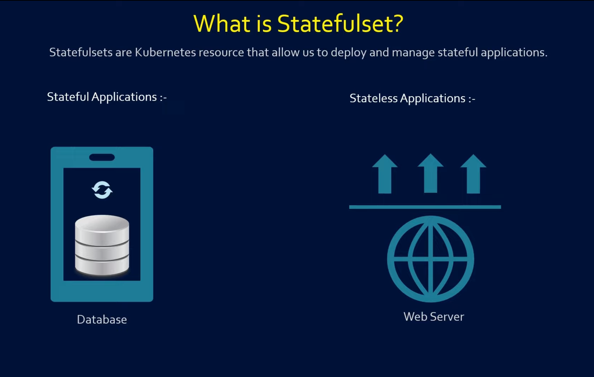
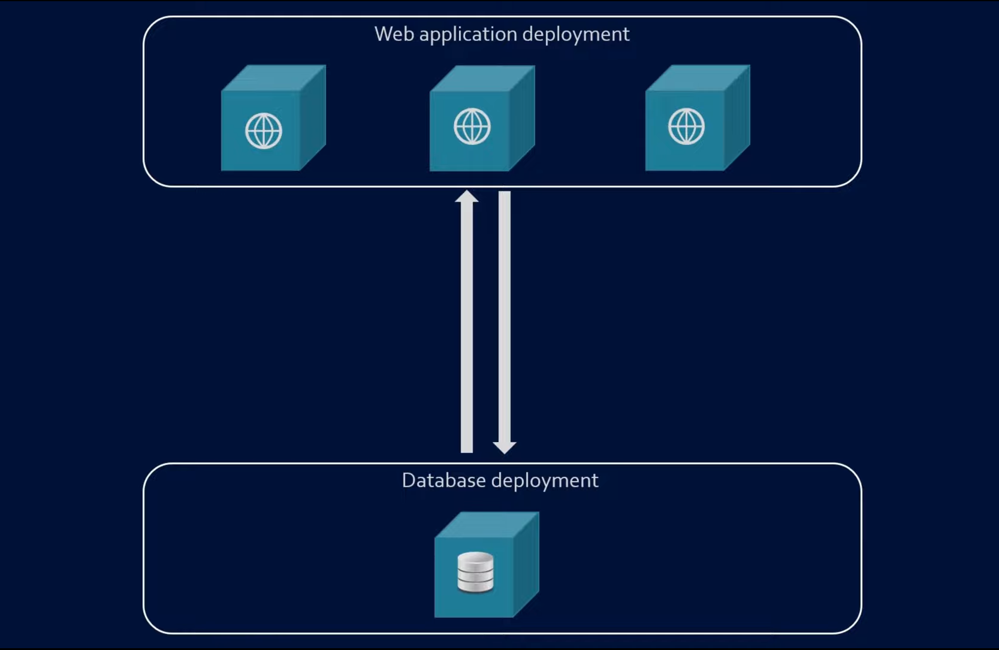
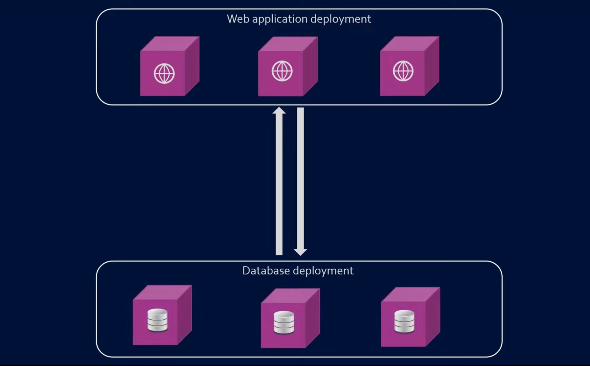
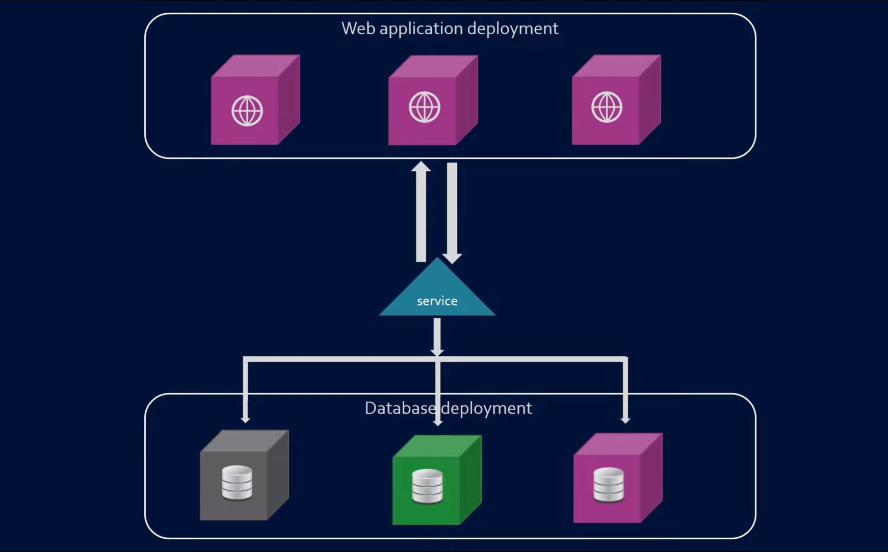
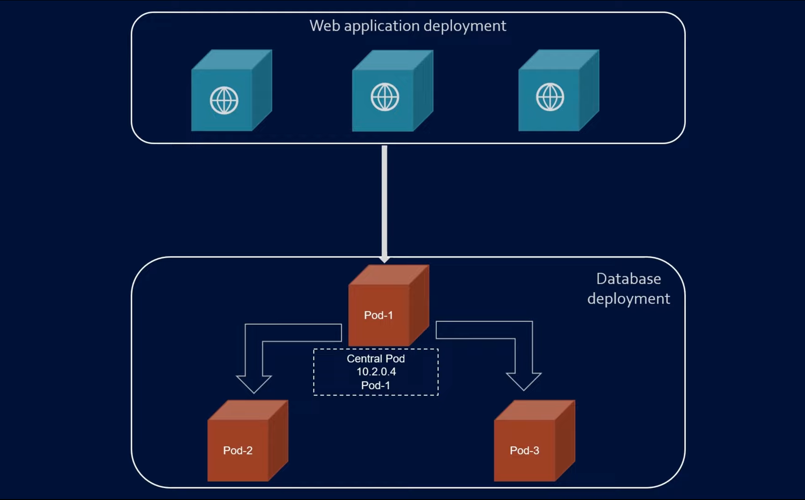

# StatefulSet in Kubernetes:

- StatefulSets are kubernetes resource that allow us to deploy and manage `Stateful` applications.
- `Stateful applications` are those applications that require a persistent storage to function properly. Example - database.
  
  
- But can we not deploy or manage a Database with Deployment object?
- Deployment vs Statefulset:
  
  - Lets say we have a web application deployed as Deployment and to make it highly available, there are three replicas of it.
  - The Application data is stored in database and we have deployed the database as Deployment too.
    
    
  - Everything is fine here, Application works fine but we have made our Application Highly Available but what about Database?
  - Let's scale the Database pods now.
    
  - Now the application wants to connect to the database for read and write operation.
  - Obviosly the traffic from web pod will go through the service of the database, and this service can route traffic to any of the backend database pods randomly.
    
  - This means that data can we written in any pod and read from any other pod. This is the biggest problem of Data inconsistency.
  - There must be something like-
    
    
    - A centralized pod where application writes data to this pod only.
    - Rest all pods should replicate the data from this pod.
    - Problems:
      - How do we tell the application that, say Pod01 is to be used for only write operations? A pod's IP gets changed if recreated and there is no proper DNS assigned for Pods.
      - How do we tell the other pods to replicate the data from the Pod01?

