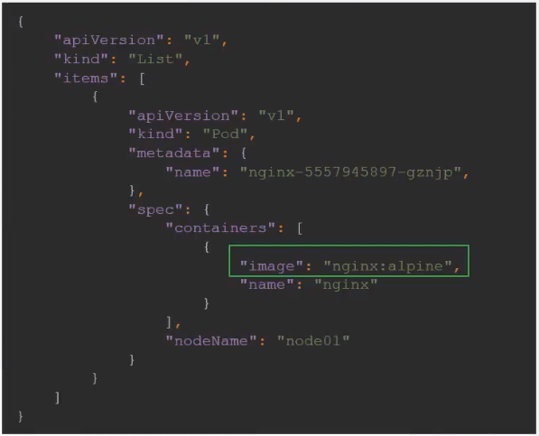
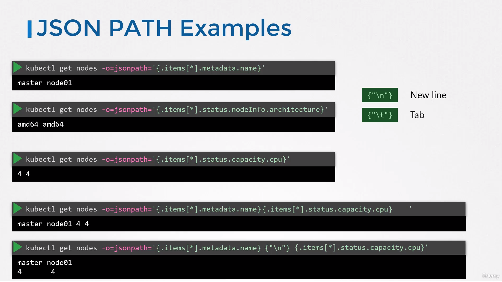
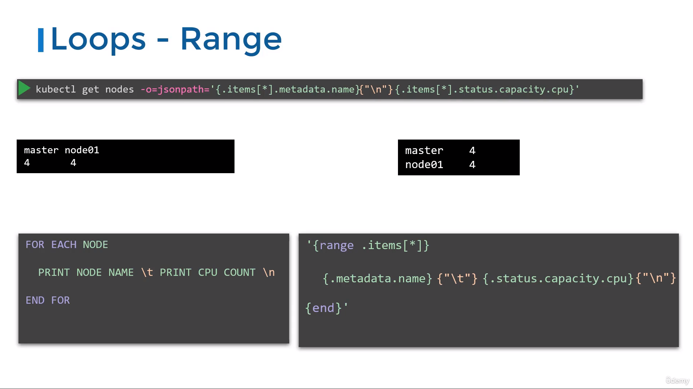
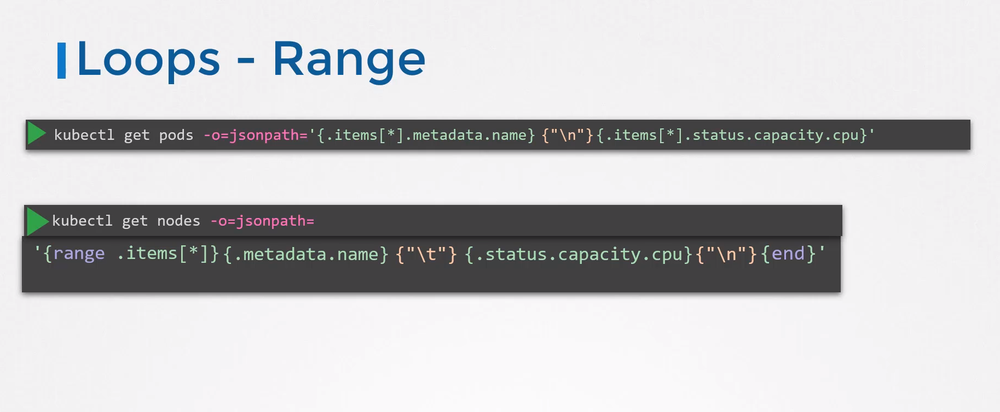
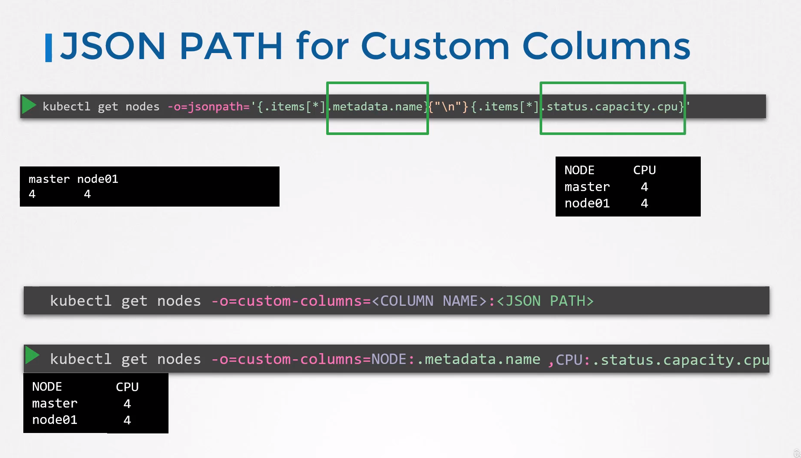
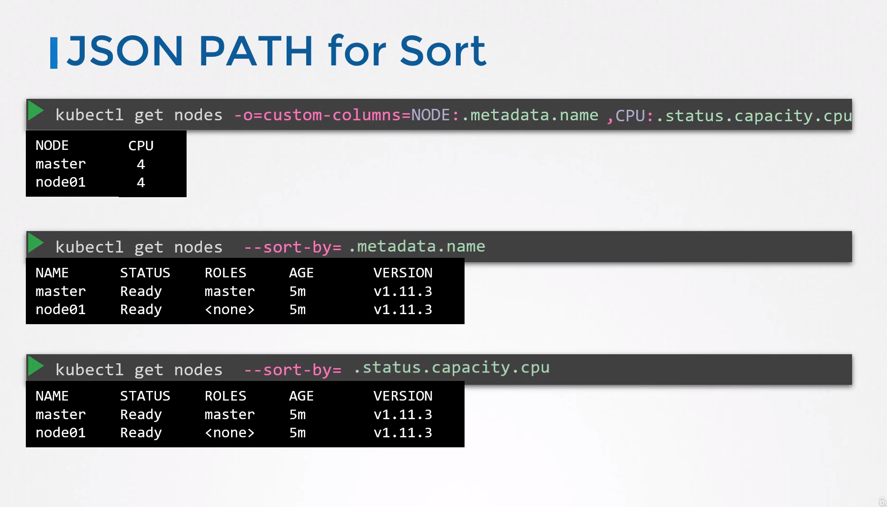

# Advance Kubectl Commands

- Take me to the [Lecture](https://kodekloud.com/topic/advanced-kubectl-commands/)
- To get the output of **`kubectl`** in a json format:
  
  ```
  kubectl get nodes -o json
  ```
  
  ```
  kubectl get pods -o json
  ```
  
  
- To get the image name used by pod via json path query:
  
  ```
  kubectl get pods -o=jsonpath='{.items[0].spec.containers[0].image}'
  ```
- To get the names of node in the cluster:
  
  ```
  kubectl get pods -o=jsonpath='{.items[*].metadata.name}'
  ```
  
  
- To get the architecture of node in the cluster:
  
  ```
  kubectl get pods -o=jsonpath='{.items[*].status.nodeInfo.architecture}'
  ```
- To get the count of the cpu of node in the cluster:
  
  ```
  kubectl get pods -o=jsonpath='{.items[*].status.status.capacity.cpu}'
  ```
  
  

#### Loops - Range :

- With the queries we have built so far we were able to get different sets of information like names of nodes, the CPU counts, et cetera in this format, but this is not what we really want. We wanted to look like this one on the right. The node names in one column and CPU counts in the other.
- This is where we use loops to iterate through items in a list and print properties of each item.
  
- Merge it all in into a single line and pass it as a parameter to the JSONpath option of the Kubectl command.
  

#### Custom Columns :

- You can also use JSONpath for printing `Custom Columns` as at times, this is an easier approach when compared to using the loop method.
  
  - To print the output in a separate column (one column with node name and other with CPU count):
    
    ```
    kubectl get nodes -o=custom-columns=NODE:.metadata.name ,CPU:.status.capacity.cpu
    ```
    
    
    

#### Sort : 

- The Kubectl command comes with a `sort by` option where you can sort the output based on the value of a property from the JSON formatted properties of each item.
  
  - Let's combine with json path query to **`sort`** by CPU count:
    
    ```
    kubectl get nodes --sort-by=.metadata.name
    ```
    
    
    
    ```
    kubectl get nodes --sort-by=..status.capacity.cpu
    ```

