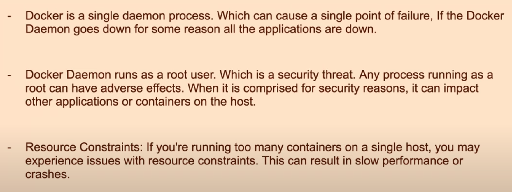
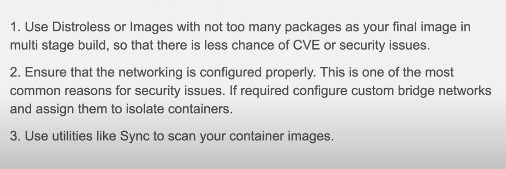

# Question 1:

#### Difference between CMD and ENTRYPOINT?

- **CMD**: When used separately, whatever is passed from the command line interface (CLI) will completely replace the specified command.
- **ENTRYPOINT**: When used separately, whatever is passed from the CLI will be appended to the specified command.
- **Combined Usage**:
  
  - **Case 1 (No argument passed from CLI)**:
    - `ENTRYPOINT ["ls","-a"]`
    - `CMD ["-l"]`
    - Command executed: `ls -a -l`
  - **Case 2 (Argument "-S" passed from CLI)**:
    - `ENTRYPOINT ["ls","-a"]`
    - `CMD ["-l"]`
    - Command executed: `ls -a -S`

# Question 2:

#### Real time challenges with Docker?

# Question 3:

#### What steps would to take to secure containers?

