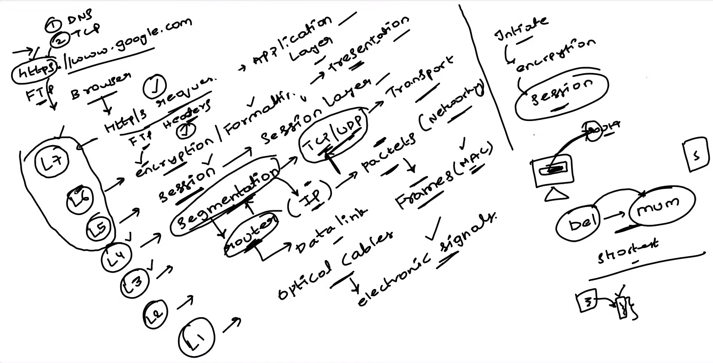
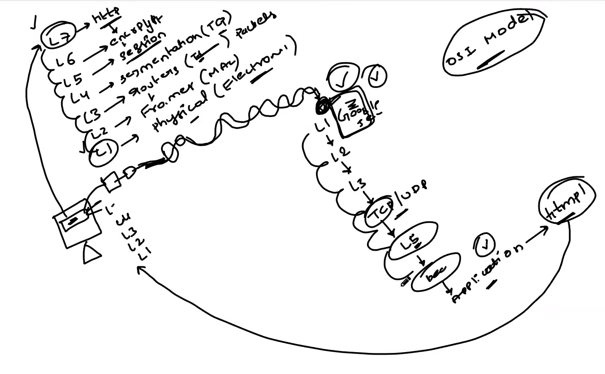

# OSI Model - Workflo

1. **Layer 7 - Application Layer**: The user opens their web browser and types "Google.com" into the address bar. At this layer, the browser initiates communication with the remote server and makes a request for the web page.
2. **Layer 6 - Presentation Layer**: The browser formats the request in a way that is understandable by both the client (browser) and the server. This layer deals with data translation and encryption if necessary.
3. **Layer 5 - Session Layer**: A session is established between the client (browser) and the server. This layer handles the setup, maintenance, and termination of the connection. For web browsing, this typically involves establishing a TCP connection.
4. **Layer 4 - Transport Layer**: The browser breaks the data into smaller packets and adds TCP (Transmission Control Protocol) headers. These packets are then sent to the network layer for further processing.
5. **Layer 3 - Network Layer**: The browser adds IP (Internet Protocol) headers to the packets to indicate the source and destination addresses. The packets are then routed through the network based on these addresses. In this case, the packets are sent from the user's device to the DNS server to resolve the domain name "Google.com" into an IP address.
6. **Layer 2 - Data Link Layer**: At this layer, the packets are encapsulated into frames. These frames include MAC (Media Access Control) addresses that identify the source and destination devices on the local network. The frames are then sent from the user's device to the local router.
7. **Layer 1 - Physical Layer**: Finally, the frames are converted into electrical signals or light pulses (depending on the transmission medium, such as Ethernet or Wi-Fi) and transmitted over the physical network medium to the local router. From there, they are forwarded through various routers and network switches until they reach Google's servers.

    

Once the packets reach Google's servers, the process is reversed:

1. The Physical Layer receives the electrical signals or light pulses and converts them back into frames.
2. The Data Link Layer removes the frames and extracts the packets.
3. The Network Layer processes the IP headers to determine the destination address and forwards the packets accordingly.
4. The Transport Layer reassembles the packets into the original data stream and removes the TCP headers.
5. The Session Layer terminates the session once the communication is complete.
6. The Presentation Layer decrypts and translates the data if necessary.
7. The Application Layer delivers the requested web page to the user's browser for display.

   

